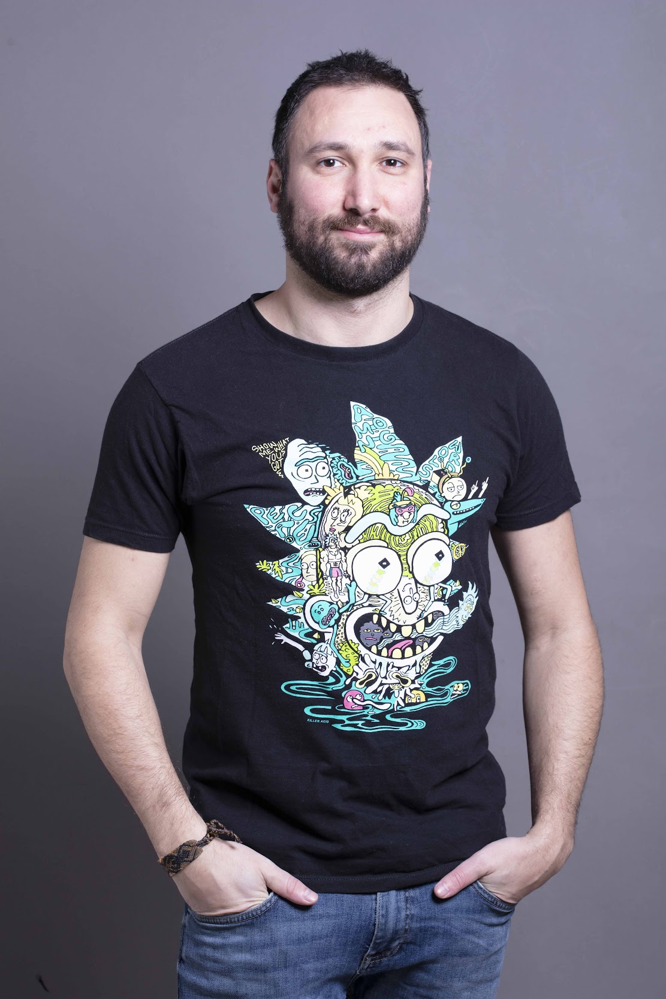

+++
title = "Home"
+++

~~~

~~~

> “Physics is like sex: sure, it may give some practical results, 
> but that's not why we do it.”
> ― Richard P. Feynman

### About

I am an Assistant Professor at [Bocconi University][Bocconi] since 2018, an open source contributor ([machine learning libraries](https://fluxml.ai/) for Julia in particular) machine learning packages and a lindy-hop dancer.

### Research

I'm currently working on questions which fall at the interface between the statistical physics of disordered systems and artificial neural networks.
[Here](/research/) I  give a quick overview of my research. 

[Bocconi]: https://www.unibocconi.eu
[Flux]: https://fluxml.ai/